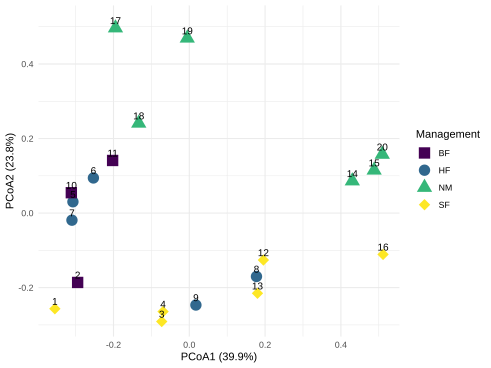
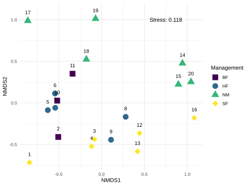
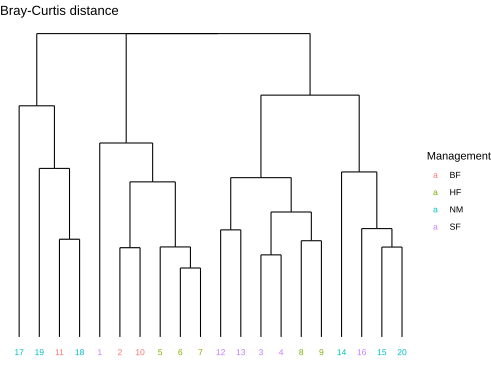

# Guide to Ecological Community Analysis

Methods covered:

- [Principle Component Analysis (PCA)](#pca)
- [Multidimensional Scaling (MDS)](#mds)
  - parametric (MDS)
  - non-parametric (NMDS)
- [Principle Coordinate Analysis](#pcoa)
- [Cluster Dendrogram](#cluster)
- [Analysis of Similarity (ANOSIM)](#anosim)

## Dataset

The example dataset is [**dune**](https://cran.r-project.org/web/packages/BiodiversityR/readme/README.html) from the `vegan` package.

### Data Preparation

- Dissimilarity matrix

## Unsupervised/Exploratory

### PCA

[Link to script.](PCA.R)

#### Biplot

---

### PCoA

Principle coordinate analysis...

[Link to script.](PCoA.R)

---

### MDS

[Link to script.](MDS.R)

Multidimensional scaling is a form of dimension reduction.

#### Stress

This table can be used as a rule of thumb.

| Stress  | Meaning                 |
| ------- | ----------------------- |
| 0.2     | poor fit                |
| 0.1–0.2 | interpret cautiously    |
| <0.1    | good ordination         |
| <0.05   | excellent               |

---

#### Resources

- [NMDS Plots in R by Jackie Zorz](https://jkzorz.github.io/2019/06/06/NMDS.html)

### Cluster

---

## Supervised/Predictive

### ANOSIM

[Link to script.](ANOSIM.R)

The analysis of similarity (ANOSIM) is a non-parametric test that uses a rank-based approach to test whether groups of samples are different.

## To Do

- [ ] Technique explanations
- [ ] Add cluster analysis
- [ ] Add ANOSIM
- [ ] Expanded figure customisation
- [ ] Add table presentation for RMarkdown
- [ ] Improve biplot in PCA script
