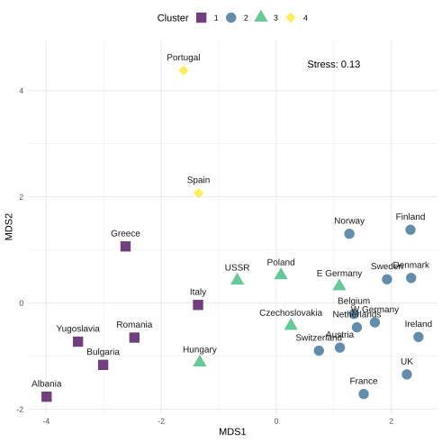

# Guide to Ecological Community Analysis

Methods covered:

- [Principle Component Analysis (PCA)](#pca)
- [Multidimensional Scaling (MDS)](#mds)
  - parametric (MDS)
  - non-parametric (NMDS)

## Dataset

<!--
The dataset `protein.csv` is the protein consumption of various European countries.
-->

The example dataset is `dune` and `dune.env` from the `vegan` package:

>The dune meadow vegetation data, dune, has cover class values of 30 species on 20 sites.

### Data Preparation

After reading in the dataset you will do intial processes to **tidy** and **standardise**.

Tidying the data means ensuring the dataset will run smoothly through the functions. Here I pipe (`|>`) together the tidying and standardising functions. Firstly, I set the `Country` column to the rownames. This removes the column from the analysis and indicates the values that will be mapped in the ordination plots. Secondly, I select the variables that I want in the plot. Note, I indicate that the `select` function is from the `dplyr` package as the `MASS` package also has a `select` function. This can be omitted if you choose not to load the `MASS` package.

## Unsupervised

### PCA

[Link to script.](PCA.R)

### MDS

[Link to script.](MDS.R)

#### Resources

- [NMDS Plots in R by Jackie Zorz](https://jkzorz.github.io/2019/06/06/NMDS.html)

#### Stress

This table can be used as a rule of thumb.

| Stress  | Meaning                 |
| ------- | ----------------------- |
| 0.2     | poor fit                |
| 0.1–0.2 | interpret cautiously    |
| <0.1    | good ordination         |
| <0.05   | excellent               |

### Cluster

## Supervised

### ANOSIM

The analysis of similarity (ANOSIM) is a non-parametric test that uses a rank-based approach to test whether groups of samples are different.

## To Do

- [ ] Technique explanations
- [ ] Add cluster analysis
- [ ] Add ANOSIM
- [ ] Expanded figure customisation
- [ ] Add table presentation for RMarkdown
- [ ] Improve biplot in PCA script
